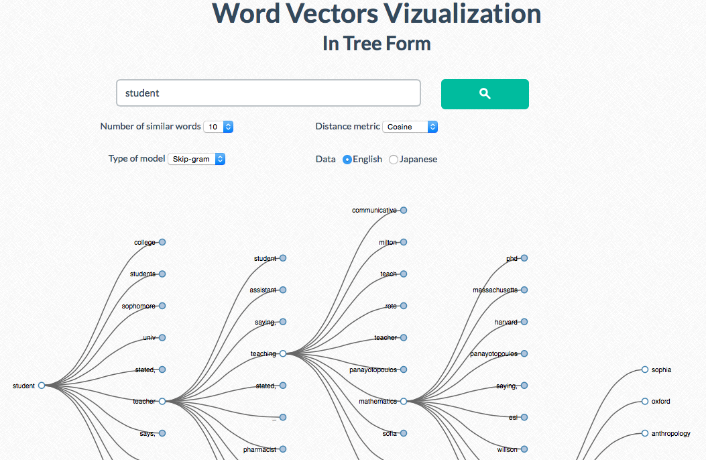
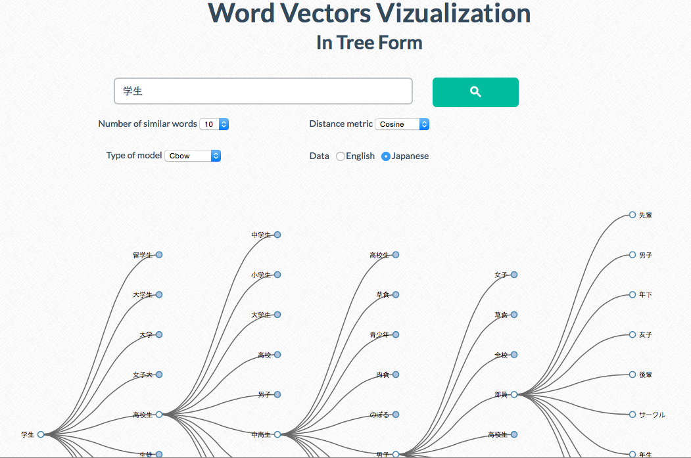

# word2vec-visualization (Python 3 / Gensim 2.3.0 Compatible)
Word Vectors Visualization in Tree Form

Authors: Van-Thuy Phi and Taishi Ikeda.

Supervisor: Kevin Duh.

- Two types of distances: Cosine distance / Euclidean distance.
- Totally 8 different models for English and Japanese data.
- To run simple HTTP server: `cd frontend && python -m http.server 8888`.
 

 
 
 
 

 

- Main files and folders:
	+ backend 
		+ HiraganaTimes_English 
			the implementation of continuous bag-of-words and skip-gram architectures for computing vector representations of words in English; skip-gram (slower, better for infrequent words) vs CBOW (fast).
		+ HiraganaTimes_Japanese 
			the implementation of continuous bag-of-words and skip-gram architectures for computing vector representations of words in Japanese.
		+ Convert_to_JSON  
			scripts for converting word2vec models to JSON files.
	+ frontend 
		+ data 
			all data for searching word and vizualizing them: `data_cosine.json` and `data_euclidean.json` are the databases. The flare-format data is created from the database when running the web page.
		+ js 
			D3.js library (visualization javascript library).
		+ index.html 
			the main web page.

- Visualize your own data
	+ To convert the word2vec models to the JSON files, the Gensim library (https://radimrehurek.com/gensim/install.html) is required.
	Quick install Gensim: `easy_install -U gensim` or, alternatively: `pip install --upgrade gensim`.
	+ Pre-process and tokenize your corpus, ensuring you exclude Special characters detailed in `Remove_Special_Characters.txt`
    + Special characters should be excluded from JSON files to generate the correct JSON format.
	+ Generate your Word2Vec Model using `model = gensim.models.Word2Vec(tokenized_sentences, size=200)`
	+ Save your Word2Vec Model using `model.wv.save_word2vec_format('model_name.bin',binary=True)`
	+ For the Cosine distance metric: use the script `create_database_cosine.py`.
	+ For the Euclidean distance metric: use the script `create_database_euclidean.py`, and copy the file `keyedvectors.py` to Gensim library's location, e.g., `/Library/Python/3.5/site-packages/gensim/models`. In this new implementation, the new method `most_similar_euclidean()` is included to calculate the distance between pairs of words/phrases by the Euclidean metric.
	+ Edit each script directing "model_path" to your saved model.
	+ Place the generated json output into the `frontend/data` dir, replacing and removing all other data if you wish to work exclusively with your own model.

A massive Thank You to all contributors!
